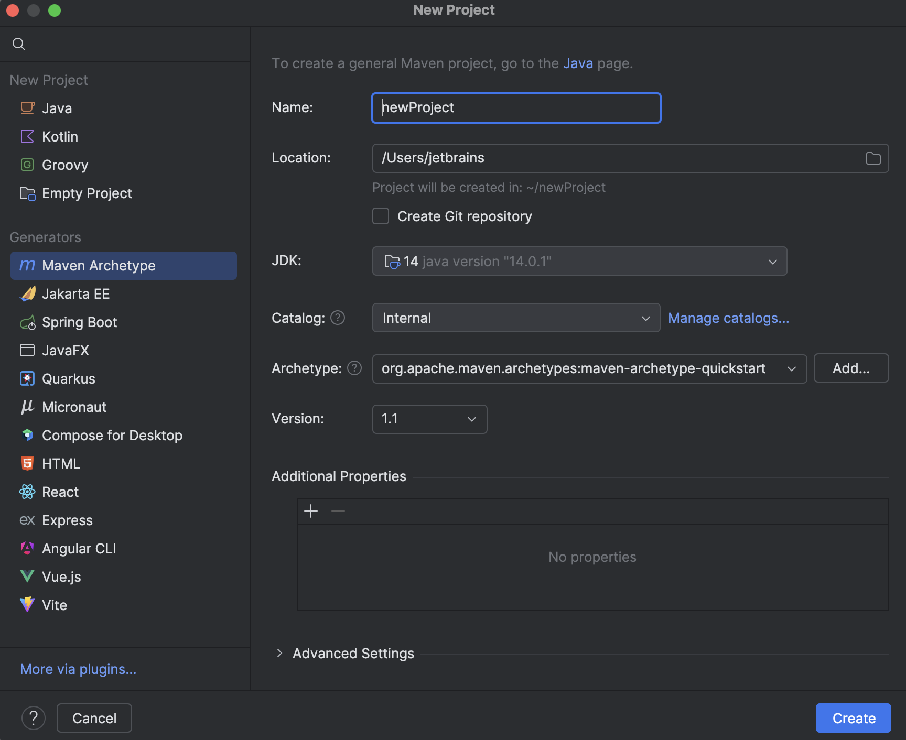
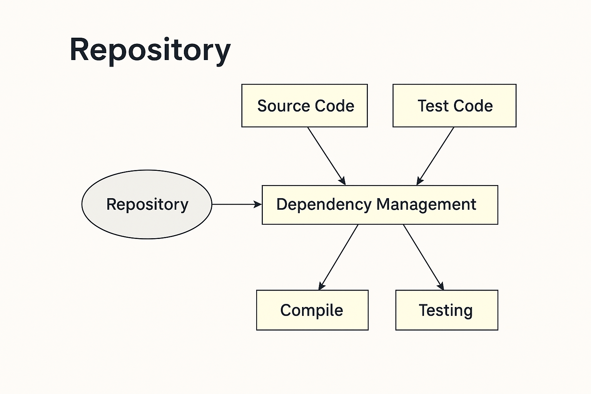
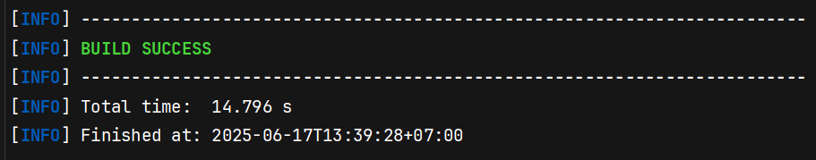
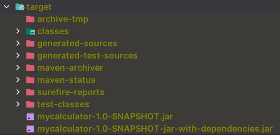
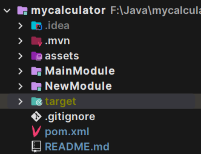

# Pengenalan Apache Maven

Maven adalah salah satu Build Automation Tool yang free dan open source. Apache Maven sangat populer dikalangan
Developer Java dan sering digunakan banyak project java. Apache Maven menggunakan XML untuk mendefinisikan build script
nya.

## Teknologi

Maven juga mendukung banyak teknologi sebagai build automation tool, seperti:

- Java
- Scala
- Kotlin
- Groovy
- Ruby
- dan banyak lainnya

## Install Maven

Silahkan download Maven melalui [Link ini](https://maven.apache.org/download.cgi)

Silahkan baca artikel ini sebagai panduan setup Maven untuk Linux dan MacOS:
[Maven Installation Guide for Linux and MacOS](https://www.geeksforgeeks.org/installation-guide/how-to-install-apache-maven-on-windows-macos-and-linux/)

Silahkan baca artikel ini untuk setup Apache Maven di Windows:
[Maven Installation Guide for Windows](https://www.geeksforgeeks.org/how-to-install-apache-maven-on-windows/)

# Membuat Project

## Archetype

Maven mendukung pembuatan berbagai macam project dengan mudah menggunakan **archetype** (template project).  

Kita bisa menggunakan template yang sudah disediakan oleh Maven, atau bahkan membuat template archetype sendiri. Baca panduan mengenai archetype [disini](https://maven.apache.org/guides/introduction/introduction-to-archetypes.html)

### Membuat Java Project dengan Maven melalui Terminal
#### 1. Jalankan Perintah
```
mvn archetype:generate
```
#### 2. Pilih Archetype
Dari daftar archetype yang muncul, pilih:
``` 
org.apache.maven.archetypes:maven-archetype-quickstart
```
Archetype ini cocok untuk membuat project Java sederhana.
#### 3. Pilih Versi
Pilih versi terbaru dari archetype tersebut yang muncul di terminal.

#### 4. Property Project
Selanjutnya, isi informasi project saat diminta:
```
Define value for property 'groupId': com.example         # Nama grup atau domain project
Define value for property 'artifactId': my-app           # Nama project atau module
Define value for property 'version' 1.0-SNAPSHOT: 1.0.0   # Versi project (bisa default)
Define value for property 'package': com.example.app     # Struktur package untuk kode Java
```
#### 5. Buka di IDE
Setelah selesai, Maven akan menghasilkan struktur project secara otomatis. Kamu bisa membuka project ini di IDE favoritmu seperti IntelliJ IDEA, NetBeans, atau Eclipse.

### Membuat Java Project dengan Maven menggunakan IDE
IDE yang akan digunakan adalah IntelliJ IDEA. Untuk IDE yang lain, silahkan disesuaikan saja. Karna caranya hampir sama.

#### 1. Buka IntelliJ IDEA, lalu pilih menu New Project → Maven Archetype dari sisi kiri jendela.


#### 2. Konfigurasi Project di Panel Kanan:
- Name: Masukkan nama proyek yang kamu inginkan.
- Location: Tentukan lokasi folder tempat proyek akan disimpan.
- Create Git Repository (*Opsional*):
  - Centang opsi ini jika ingin langsung menginisialisasi repositori Git untuk proyek.
  - Opsi ini bisa dilakukan nanti juga.
  - Catatan: IntelliJ tetap membuat file `.gitignore` secara otomatis.

#### 3. Pilih SDK (JDK):
- GUnakan JDK yang tersedia atau pilih versi JDK yang sesuai dengan proyek.

#### 4. Catalog:
- Pilih suber katalog Maven:
  - Internal (*default*)
  - Local Repository (*.m2*)
  - Maven Central
  - Klik Manage Catalogs jika ingin menambahkan katalog khusus.

#### 5. Archetype:
- Pilih jenis **Archetype Maven** yang akan digunakan, seperti:
  - `org.apache.maven.archetypes:maven-archetype-quickstart`
- Klik **Add** jika ingin menambahkan archetype kustom

#### 6. Version
- Versi archetype biasanya terisi otomatis.
- Bisa diganti sesuai kebutuhan project.

#### 7. Additional Properties (*Opsional*):
- Tambahkan properti tambahan jika diperlukan untuk konfigurasi Maven.

#### 8. Setelah semua terisi, klik tombol **Create** di kanan bawah untuk membuat project.

## Project Structure

Struktur direktori dari project maven yang telah digenerate akan berbentuk seperti ini.


# Maven Lifecycle

Maven bekerja berdasarkan konsep **lifecycle** (siklus hidup), yaitu urutan tahapan yang harus dilalui untuk membangun
dan mendistribusikan sebuah project. Dengan lifecycle, proses build jadi lebih **otomatis, konsisten**, dan **mudah
dikelola**.

Penjelasan lengkap bisa dibaca di dokumentasi
resminya: [Introduction to the Build Lifecycle – Maven](https://maven.apache.org/guides/introduction/introduction-to-the-lifecycle.html)

## Contoh Lifecycle

Berikut adalah beberapa tahapan umum dalam *lifecycle* Maven beserta penjelasan sederhananya:

| Fase               | Penjelasan                                                                    |
|--------------------|-------------------------------------------------------------------------------|
| **`clean`**        | Menghapus folder `target`, supaya build dimulai dari awal.                    |
| **`compile`**      | Mengkompilasi source code utama (biasanya dari `src/main/java`).              |
| **`test-compile`** | Mengkompilasi source code untuk testing (`src/test/java`).                    |
| **`test`**         | Menjalankan unit test otomatis untuk memastikan kode bekerja dengan benar.    |
| **`package`**      | Mengemas aplikasi jadi file `.jar`, `.war`, atau format lainnya.              |
| **`install`**      | Menyimpan hasil build ke **local repository**, agar bisa dipakai proyek lain. |
| **`deploy`**       | Mengirim hasil build ke **remote repository** (misalnya Nexus, Artifactory).  |

# Dependency
Dalam project Java, seringkali kita membutuhkan dependency (library) lain, misalnya untuk logging, koneksi database, atau testing.

**Tanpa Maven**, kita harus:
- Mencari file `.jar` secara manual.
- Menyalin file ke folder project.
- Mengatur classpath sendiri.

**Dengan Maven**, semua proses itu otomatis. Cukup tambahkan informasi dependency pada file `pom.xml`, maka Maven akan:
- Mengunduh file `.jar` yang dibutuhkan.
- Memasukkannya kedalam project secara otomatis.
- Mengatur classpath dengan benar.

## Dependency Scope
Saat menambahkan dependency ke dalam Maven, kita bisa menentukan scope-nya, yaitu ruang lingkup penggunaannya:

| Scope         | Deskripsi                                                                                                    |
|---------------|--------------------------------------------------------------------------------------------------------------|
| **`compile`** | (default) Dependency digunakan untuk proses kompilasi, test, dan saat aplikasi dijalankan                    |
| **`test`**    | Dependency hanya digunakan untuk keperluan testing (misal: JUnit). Tidak akan ikut saat aplikasi dijalankan. |

Scope lain yang lebih jarang digunakan: `provided`, `runtime`, `system`, `import`.

Baca panduan mengenai mekanisme dependency disini [Introduction to dependency mechanism](https://maven.apache.org/guides/introduction/introduction-to-dependency-mechanism.html)

### Contoh kode menambahkan Dependency
```xml
<dependencies>
  <dependency>
    <groupId>junit</groupId>
    <artifactId>junit</artifactId>
    <version>3.8.1</version>
    <scope>test</scope>
  </dependency>
</dependencies>
```

## Situs Pencarian Dependency Maven
Untuk mencari dependency yang ingin ditambahkan, kamu bisa menggunakan:
- [https://search.maven.org/](https://search.maven.org/)
- [https://mvnrepository.com/](https://mvnrepository.com/)

## Repository
Repository adalah tempat penyimpanan library atau dependency yang dibutuhkan oleh sebuah project Maven. Ketika menambahkan dependency ke dalam `pom.xml`, Maven akan mencarinya di repository yang sudah ditentukan.



Seperti pada di gambar, arsitektur repository bekerja sebagai berikut:
- **Source Code** dan **Test Code** membutuhkan library external.
- **Dependency Management** mengelola semua kebutuhan library.
- Dari **Repository**, dependency akan ditarik untuk digunakan pada saat:
  - Compile
  - Testing

### Jenis Repository di Maven
| Jenis Repository   | Keterangan                                                                                           |
|--------------------|------------------------------------------------------------------------------------------------------|
| Local Repository   | Terletak di komputer user (`~/.m2/repository`). Diisi otomatis saat Maven mengunduh dependency       |
| Central Repository | Repository default Maven yang bersifat public                                                        |
| Remote Repository  | Repository eksternal (biasanya milik pihak ketiga) yang bisa ditambahkan secara manual ke `pom.xml`. |

### Contoh kode menambahkan repository
```xml
<project>
  [...]
  <repositories>
    <repository>
      <id>custom-repo</id>
      <name>custom-repo-name</name>
      <url>https://example.com/maven-repo</url>
    </repository>
  </repositories>
</project>
```

# Maven Properties
Maven mendukung penggunaan **properties** untuk menyimpan data konfigurasi project. Fitur ini sangat bermanfaat karena memungkinkan kita untuk **menghindari hardcode** nilai secara langsung di dalam file `pom.xml`.

Dengan menggunakan properties, konfigurasi menjadi lebih **terstruktur, mudah dikelola**, dan dapat digunakan kembali di berbagai bagian project. Ini sangat membantu terutama ketika nilai seperti versi library, encoding, atau pengaturan compiler perlu digunakan di beberapa tempat sekaligus.

### Contoh kode Maven Properties
```xml
<project>
  [...]
  <properties>
    <project.build.sourceEncoding>UTF-8</project.build.sourceEncoding>
    <maven.compiler.release>17</maven.compiler.release>
    <junit.version>5.12.0</junit.version>
  </properties>
</project>
```


### Contoh kode menggunakan Maven Properties
```xml
<dependency>
  <groupId>org.junit.jupiter</groupId>
  <artifactId>junit-jupiter</artifactId>
  <version>${junit.version}</version>
  <scope>test</scope>
</dependency>
```

# Membuat Distribution File
Secara default, Maven mendukung pembuatan distribution file menggunakan lifecycle `package`. Namun, file hasil build tersebut biasanya hanya berupa file `.jar` berisi binary code dari project kita **tanpa menyertakan dependency** lain yang dibutuhkan. Akibatnya, file `.jar` ini **tidak bisa langsung dijalankan**, terutama jika bergantung pada library external.

## Menggunakan Maven Assemply Plugin
Untuk membuat distribution file yang lengkap beserta seluruh dependency-nya, salah satu solusi yang dapat digunakan adalah **Maven Assembly Plugin**. Plugin ini memungkinkan kita untuk membuat bundle file `.jar` utama beserta seluruh dependency dalam satu file (`fat jar` atau `uber jar`).

Baca dokumentasi mengenai Maven Assembly Plugin [disini](https://maven.apache.org/plugins/maven-assembly-plugin/usage.html).

## Cara menggunakan Maven Assembly Plugin
Tambahkan konfigurasi plugin berikut ke dalam `pom.xml`
```xml

<project>
  [...]
  <build>
    [...]
    <plugins>
      <plugin>
        <!-- Tambahkan kode plugin Maven Assembly nya -->
        <artifactId>maven-assembly-plugin</artifactId>
        <version>3.7.1</version>
        <configuration>
          <descriptorRefs>
            <descriptorRef>jar-with-dependencies</descriptorRef>
          </descriptorRefs>
          
          <!-- Menentukan main file -->
          <archive>
            <manifest>
              <mainClass>ganti.dengan.main.class.kamu</mainClass>
            </manifest>
          </archive>
          
        </configuration>

        <!-- Tambahkan kode ini jika ingin dibundle menjadi 1 distribution file -->
        <executions>
          <execution>
            <id>make-assembly</id> <!-- this is used for inheritance merges -->
            <phase>package</phase> <!-- bind to the packaging phase -->
            <goals>
              <goal>single</goal>
            </goals>
          </execution>
        </executions>
      </plugin>
    </plugins>
  </build>
  [...]
</project>
```

Setelah konfigurasi ditambahkan, buat distribution file dengan menjalankan perintah ini:
```
mvn package assembly:single
```

Setelah build berhasil


Maka 2 file .jar akan terbuat seperti ini


`mycalculator-1.0-SNAPSHOT.jar` merupakan file `.jar` **standar** yang hanya berisi class hasil kompilasi project sendiri tanpa menyertakan dependency (library dari luar) yang dibutuhkan.

Sedangkan `mycalculator-1.0-SNAPSHOT-jar-with-dependencies.jar` merupakan file **fat jar** yang dihasilkan oleh Maven Assembly Plugin. File ini berisi class dari project, Semua dependency yang dibutuhkan, dan sudah siap langsung dijalankan.

Untuk menjalankannya, gunakan perintah dibawah ini:
```
java -jar target/mycalculator-1.0-SNAPSHOT-jar-with-dependencies.jar
```

# Multi Module Project
Ketika aplikasi semakin besar dan kompleks, sangat disarankan untuk memecahnya menjadi beberapa modul agar lebih mudah dikelola dan dikembangkan. Misalnya, kita bisa memisahkan bagian **model, controller, view, service, repository,** dan sebagainya ke dalam modul-modul yang terpisah.

Untungnya, Maven mendukung struktur multi-module project, yaitu proyek utama yang terdiri dari beberapa submodul (anak proyek) yang saling terintegrasi.

### Struktur Multi-Module
Contoh struktur direktori:
```
my-app/
├── pom.xml             ← parent POM
├── model/
│   └── pom.xml         ← modul model
├── service/
│   └── pom.xml         ← modul service
└── web/
    └── pom.xml         ← modul web
```

## Membuat Module Baru
Untuk membuat module baru menggunakan IntelliJ IDEA, kamu bisa mengikuti langkah-langkah seperti pada video berikut:
https://github.com/user-attachments/assets/f6dc622e-74de-4ef1-ac38-c4e4dfc01790

Sebagai contoh, saya menambahkan 2 module baru dengan nama **MainModule** dan **NewModule**, dan struktur project berubah menjadi seperti berikut:



Jika sebelumnya kamu sudah memiliki source code pada folder `src` di root project, kamu bisa **memindahkannya ke dalam folder `src` di dalam** `MainModule` agar mengikuti struktur multi-module.

## Konfigurasi Module
Setelah membuat module baru, IntelliJ IDEA akan otomatis menghasilkan file pom.xml di dalam module tersebut, dengan konfigurasi seperti berikut:
```xml
<project>
  [...]
  <parent>
    <groupId>com.felfeit</groupId>
    <artifactId>mycalculator</artifactId>
    <version>1.0-SNAPSHOT</version>
  </parent>
  <artifactId>NewModule</artifactId>
  [...]
</project>
```
Bagian `<parent>` menunjukkan bahwa module ini berada di bawah parent project `mycalculator`.

## Konfigurasi Parent Module
Pada file `pom.xml` di root project (sebagai parent), akan ditambahkan konfigurasi baru oleh IntelliJ IDEA secara otomatis seperti ini:

```xml
<groupId>com.felfeit</groupId>
<artifactId>mycalculator</artifactId>
<version>1.0-SNAPSHOT</version>
<packaging>pom</packaging> <!-- Menandakan ini adalah parent POM -->

<name>mycalculator</name>
        <!-- FIXME change it to the project's website -->
<url>http://www.example.com</url>

<modules>
<module>NewModule</module> <!-- Mendaftarkan Module NewModule-->
<module>MainModule</module> <!-- Mendaftarkan Module MainModule -->
</modules>
```
Bagian `<packaging>pom</packaging>` penting karena menyatakan bahwa project ini hanya berfungsi sebagai pengelola untuk module-module di dalamnya.

## Include Antar Module
Dalam project multi-module, kita bisa menggunakan class dari satu module di module lainnya. Misalnya, kita ingin menggunakan class `Person` dari `NewModule` di dalam `MainModule`.

### 1. Buat class Person di NewModule
```java
package com.example.newmodule;

public class Person {
    private String name;

    public Person(String name) {
        this.name = name;
    }

    public String getName() {
        return name;
    }

    public void setName(String name) {
        this.name = name;
    }
}
```

### 2. Tambahkan New Module sebagai Dependency di MainModule
```xml
<!-- MainModule/pom.xml -->
<dependencies>
  <dependency>
    <groupId>com.example</groupId>
    <artifactId>NewModule</artifactId>
    <version>${project.version}</version>
  </dependency>
</dependencies>
```

### 3. Gunakan class Person di MainModule
```java
// MainModule/src/main/java/com/example/mainmodule/MainApp.java
package com.example.mainmodule;

import com.example.newmodule.Person;

public class MainApp {
    public static void main(String[] args) {
        Person person = new Person("Joko");
        System.out.println("Hello, " + person.getName());
    }
}
```

Dengan begitu, kamu berhasil menggunakan class dari module lain hanya dengan menambahkan dependency di `pom.xml` dan mengimpor class-nya seperti biasa. Simpel dan bersih.

# Dependency Management
Ketika sebuah project sudah memiliki banyak module dan banyak dependency, sangat mudah terjadi konflik versi antara library yang sama. Untuk menghindari hal ini, Maven menyediakan fitur **Dependency Management**.

Dengan fitur ini, kamu cukup mendefinisikan versi dependency di satu tempat saja—biasanya di file `pom.xml` milik parent module. Setelah itu, setiap module cukup mendeklarasikan dependency-nya tanpa menyebutkan versi, karena Maven akan otomatis mengambil versi dari bagian `dependencyManagement`.

## Contoh penggunaan

### 1. Dependency Management di Parent
Tambahkan di Parent `pom.xml`
```xml
<dependencyManagement>
    <dependencies>
        <dependency>
            <groupId>org.junit.jupiter</groupId>
            <artifactId>junit-jupiter</artifactId>
            <version>${junit.version}</version>
            <scope>test</scope>
        </dependency>
    </dependencies>
</dependencyManagement>
```
Artinya: semua module yang butuh `junit` tidak perlu lagi menulis versinya.

### 2. Dependency di Module
Gunakan di Child Module-nya tanpa versi
```xml
 <dependencies>
  <dependency>
    <groupId>org.junit.jupiter</groupId>
    <artifactId>junit-jupiter</artifactId>
    <scope>test</scope>
  </dependency>
</dependencies>
```
Versi dependency tetap akan digunakan karena sudah diatur di parent.