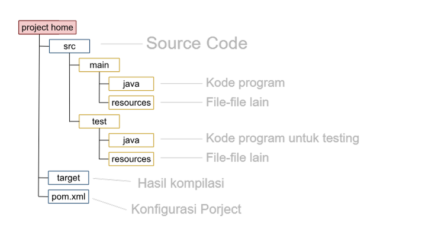

# Pengenalan Apache Maven

Maven adalah salah satu Build Automation Tool yang free dan open source. Apache Maven sangat populer dikalangan
Developer Java dan sering digunakan banyak project java. Apache Maven menggunakan XML untuk mendefinisikan build script
nya.

## Teknologi

Maven juga mendukung banyak teknologi sebagai build automation tool, seperti:

- Java
- Scala
- Kotlin
- Groovy
- Ruby
- dan banyak lainnya

## Install Maven

Silahkan download Maven melalui [Link ini](https://maven.apache.org/download.cgi)

Silahkan baca artikel ini sebagai panduan setup Maven untuk Linux dan MacOS:
[Maven Installation Guide for Linux and MacOS](https://www.geeksforgeeks.org/installation-guide/how-to-install-apache-maven-on-windows-macos-and-linux/)

Silahkan baca artikel ini untuk setup Apache Maven di Windows:
[Maven Installation Guide for Windows](https://www.geeksforgeeks.org/how-to-install-apache-maven-on-windows/)

# Membuat Project

## Archetype

Maven mendukung pembuatan berbagai macam project dengan mudah menggunakan **archetype** (template project).  

Kita bisa menggunakan template yang sudah disediakan oleh Maven, atau bahkan membuat template archetype sendiri. Baca panduan mengenai archetype [disini](https://maven.apache.org/guides/introduction/introduction-to-archetypes.html)

### Membuat Java Project dengan Maven melalui Terminal
#### 1. Jalankan Perintah
```
mvn archetype:generate
```
#### 2. Pilih Archetype
Dari daftar archetype yang muncul, pilih:
``` 
org.apache.maven.archetypes:maven-archetype-quickstart
```
Archetype ini cocok untuk membuat project Java sederhana.
#### 3. Pilih Versi
Pilih versi terbaru dari archetype tersebut yang muncul di terminal.

#### 4. Property Project
Selanjutnya, isi informasi project saat diminta:
```
Define value for property 'groupId': com.example         # Nama grup atau domain project
Define value for property 'artifactId': my-app           # Nama project atau module
Define value for property 'version' 1.0-SNAPSHOT: 1.0.0   # Versi project (bisa default)
Define value for property 'package': com.example.app     # Struktur package untuk kode Java
```
#### 5. Buka di IDE
Setelah selesai, Maven akan menghasilkan struktur project secara otomatis. Kamu bisa membuka project ini di IDE favoritmu seperti IntelliJ IDEA, NetBeans, atau Eclipse.

### Membuat Java Project dengan Maven menggunakan IDE
IDE yang akan digunakan adalah IntelliJ IDEA. Untuk IDE yang lain, silahkan disesuaikan saja. Karna caranya hampir sama.

#### 1. Buka IntelliJ IDEA, lalu pilih menu New Project → Maven Archetype dari sisi kiri jendela.


#### 2. Konfigurasi Project di Panel Kanan:
- Name: Masukkan nama proyek yang kamu inginkan.
- Location: Tentukan lokasi folder tempat proyek akan disimpan.
- Create Git Repository (*Opsional*):
  - Centang opsi ini jika ingin langsung menginisialisasi repositori Git untuk proyek.
  - Opsi ini bisa dilakukan nanti juga.
  - Catatan: IntelliJ tetap membuat file `.gitignore` secara otomatis.

#### 3. Pilih SDK (JDK):
- GUnakan JDK yang tersedia atau pilih versi JDK yang sesuai dengan proyek.

#### 4. Catalog:
- Pilih suber katalog Maven:
  - Internal (*default*)
  - Local Repository (*.m2*)
  - Maven Central
  - Klik Manage Catalogs jika ingin menambahkan katalog khusus.

#### 5. Archetype:
- Pilih jenis **Archetype Maven** yang akan digunakan, seperti:
  - `org.apache.maven.archetypes:maven-archetype-quickstart`
- Klik **Add** jika ingin menambahkan archetype kustom

#### 6. Version
- Versi archetype biasanya terisi otomatis.
- Bisa diganti sesuai kebutuhan project.

#### 7. Additional Properties (*Opsional*):
- Tambahkan properti tambahan jika diperlukan untuk konfigurasi Maven.

#### 8. Setelah semua terisi, klik tombol **Create** di kanan bawah untuk membuat project.

## Project Structure

Struktur direktori dari project maven yang telah digenerate akan berbentuk seperti ini.



# Maven Lifecycle

Maven bekerja berdasarkan konsep **lifecycle** (siklus hidup), yaitu urutan tahapan yang harus dilalui untuk membangun
dan mendistribusikan sebuah project. Dengan lifecycle, proses build jadi lebih **otomatis, konsisten**, dan **mudah
dikelola**.

Penjelasan lengkap bisa dibaca di dokumentasi
resminya: [Introduction to the Build Lifecycle – Maven](https://maven.apache.org/guides/introduction/introduction-to-the-lifecycle.html)

## Contoh Lifecycle

Berikut adalah beberapa tahapan umum dalam *lifecycle* Maven beserta penjelasan sederhananya:

| Fase               | Penjelasan                                                                    |
|--------------------|-------------------------------------------------------------------------------|
| **`clean`**        | Menghapus folder `target`, supaya build dimulai dari awal.                    |
| **`compile`**      | Mengkompilasi source code utama (biasanya dari `src/main/java`).              |
| **`test-compile`** | Mengkompilasi source code untuk testing (`src/test/java`).                    |
| **`test`**         | Menjalankan unit test otomatis untuk memastikan kode bekerja dengan benar.    |
| **`package`**      | Mengemas aplikasi jadi file `.jar`, `.war`, atau format lainnya.              |
| **`install`**      | Menyimpan hasil build ke **local repository**, agar bisa dipakai proyek lain. |
| **`deploy`**       | Mengirim hasil build ke **remote repository** (misalnya Nexus, Artifactory).  |